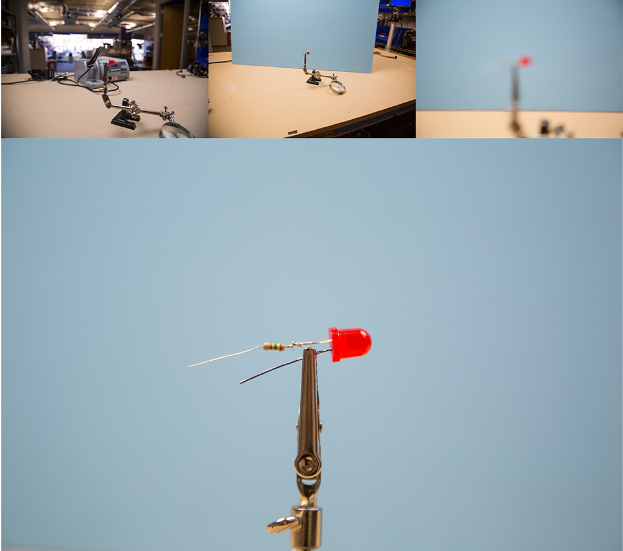
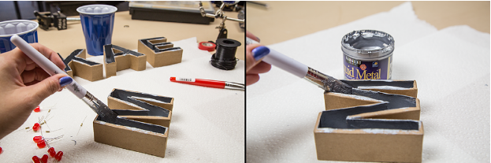
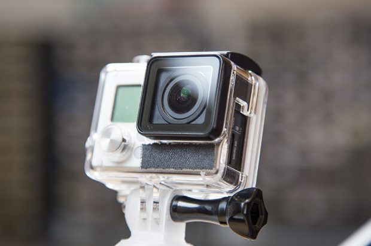
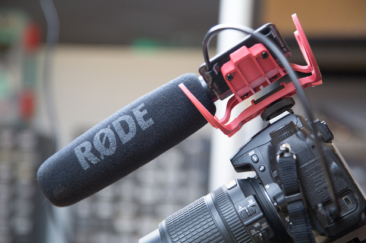

# Tips & Tricks on Documenting Your Work

1. Project Basics
    - Pre-Project Checklist
    - Your Project
2. Uploading Photos
    - Adding Images
    - Choosing how many Images to Upload
3. Taking Photos
    - Picturing your Project
        - Cover photo (required)
        - Materials photo
        - Step Photos
        - In use Photos
    - Before Shooting your Project
        - Know your Camera
        - Check your Memory Card!
        - Adjust your Settings
    - Improving your Photos
        - Move Around
        - Bounce your Flash
        - Clean your Workspace
        - Depth of Field Tricks
        - Lay Flat Photography
        - DIY Lightboxing
        - Edit your Images
4. Uploading Videos
    - Adding Video to your Project
    - Show & Tell
5. Shooting Video
    - Deciding how much Video to Shoot
    - Improving your Video
        - Start with a Script
        - Be sure to Answer these Questions
        - Let your Script be your Guide
        - Don't Worry about your Camera
        - Do Worry about your Audio
        - Other Tips & Tricks
        - When in Doubt, Add a Cat
        - Edit your Videos

# Section 01: Project Basics

## Pre-Project Checklist

*Before you start a project, it's important to have an idea about what that project entails.*

Projects are a place to show off your work. A project can be anything you've worked on
by yourself or with someone else. Built a robot? Sketched a comic? Figured out useful
ways of encouraging your kid to make? Awesome! All of these are projects that other
people would love to hear about.

It's also important to point out that a project doesn't have to be a DIY build. Did you
help create a MakerSpace? Set up a STEM/STEAM club at your school? The Maker
movement is very inclusive and if you've made any contributions to it, we would love to
hear about it. 

Additionally, we'd like to dispel the idea that Makers or Making needs to involve some
form of tech. Makers of all kinds exist, from the tech-based makers who use things like
Arduino and Raspberry Pi, to bakers, woodworkers, paper crafters, crocheters,
cosplayers, food artisans, tailors, blacksmiths, drone pilots, photographers, artists, and
makers of no particular subgroup. We hope that anyone who makes things will choose
to share them here.

## Your Project

*Project creation is divided into two sections, Your Story and How-To.*

Your project is a place for you to creatively express and showcase what you've done.
Through any combination of images, text, and video you get to determine how people
will experience your project.

The Your Story section is required for every project. This is where you can tell everyone
what you did and why. You can elaborate on your projects backstory, where you got the
idea, your influences, things you've learned, and hurdles along the way. We want you to
express what this project means to you, and anything else you feel is important. This is
also a space for anything you feel doesn't fall under the How-To section of the project.

The How-To section is not required, but we hope that people will choose to share their
process. This is where you can give people a step-by-step sequence of events to follow
that would allow them to best follow your example. I can be presented in video, images,
a story, or any other method you think might work best to express how to build your
project.

# Section 02: Uploading Photos
## Adding images

*Making the most of your images.*

You can upload images directly to your project and place them where ever you like with
the image button in the rich text fields.

## Choosing how many images to upload

*Try to select as few images as possible that get the point across.*

    

Treading the line of choosing enough images that people will be engaged, but not so
many images that they will be immediately turned off is very difficult. A good plan of
attack is to take more image of the project then you'll think you need. Later, when
you're writing up the project and find yourself needing to refer to an image to explain
something, find the image that best visualizes what you're trying to describe.

If you can express what you're trying to say with just one image, awesome! If you need
two or three, that's still absolutely fine. If you find yourself uploading every single image
you took of the build, you might be uploading too much.

# Section 03: Taking Photos
## Picturing Your Project: Cover Photo

*A Cover Photo will represent your project across the website.*

    

This is everyone's first impression of your project, so spend a little time comparing the
images that best represent your project, and choose the one that you feel works best
for that, and also serves to further the design of your portfolio.

Project photo: Sometimes called the opener, beauty, finished or final photo. These
show how the project looks when completed, on a clean background or in an
appropriate environment (e.g., on a workbench or outside).

## Picturing Your Project: Materials Photo

Shows all materials needed for the project.

    

Ideally arranged in a single horizontal-format photo shot from above (for better clarity),
along with important tools.

Generally, only one example of each material needs to be shown, e.g. just one 2x4
instead of the whole stack of wood needed for the project.

It's helpful to organize the materials and tools the same way you list them: in the order
that they're introduced in your project. Your order can move back and forth across the
photo, or around in a big circle, but so long as there is an organization, it makes it easier
for others to find the specific materials you call out without having to hunt around. It
might also be beneficial to include any new or unusual materials, or those that may be
esoteric or hard to find. (Single shots of these unusual materials can be helpful).

When laying out items it helps to put them in an orderly and easy to read fashion. This
will also allow the you to simply add text annotations to the photo later.

## Picturing Your Project: Steps Photo

*Demonstrate how to put the project together, step by step.*

    

These images may or may not include hands in the shot. When thinking of how to frame
Step photos, it's helpful to construct the final shot as if you're going to use it to explain
to a 9-year-old how to build your project.

Take plenty of extra shots and in-between steps; even if you don't think they'll be useful
later. It's better to have a shot of a step you didn't realize you'd need a photo to explain
later, then to be stuck with no photo and trying to describe it (or having to redo the
build to get a single shot).

If it's helpful for demonstrating a technique, photograph someone using a particular
tool or working the particular technique. We would also encourage you to take images
of sketches, drafts, outlines, and notes so all of your build resources can be located in
one place. These images also come in handy when detailing your story, or giving a
jumping off point to your How-To.

    

Remember to keep the background clean and empty so as to make the shot as easy to
understand as possible. When positioning the hands, make it as simple as possible to
understand. It helps to use a tripod or a friend to shoot.

## Picturing Your Project: In Use Photos

*Show the project functioning.*

    

Sometimes it's helpful to show how a project is used by demonstrating that up in an
image. Show people interacting with the project. If your project has movement, please
shoot it moving.

Consider a slow shutter speed to show a little motion blur (not too much!). And if you
can, shoot a little video of it in motion, and use that to create a Show & Tell video.

## Before Shooting your Project: Know your Camera

*Before shooting, check your camera, card, and settings.*

    

If you have small details to shoot, make sure your camera has a Macro function (for
shooting close-ups). This is the only way to get great, detailed shots of your small
work. Some projects need the macro lens to communicate these small details. You can
also purchase inexpensive clip-on macro lenses for cell phones. While we wouldn't
have recommended them in the past, the latest generation of smartphone cameras, on
their highest resolution settings, can take fantastic photos.

Point-and-shoot cameras are good for overall shots and large shots, but they're usually
not great for details. If in doubt, try taking a couple of macro photo's and see how they
look blown up to full size on your computer (or printed out). If in doubt, find a friend
with a DSLR for best results.

Know how to turn on and off the flash so that you can control its light.

## Before Shooting your Project: Check your Memory Card

Trust us, you don't want to forget this. 

    

Make sure you have a fresh card in the camera that will hold all your shots. Every
photographer has experienced that moment when they realized the memory card was
not in the camera or it was not formatted; don't let this happen to you.

## Before Shooting your Project: Adjust your Settings

*Take a few test shots before you start.*

    

Play with the ISO settings (grain). Just make sure you don't go over 400 ISO, because
the images become grainy. Stick to lower ISO.

Make sure you're shooting on the highest resolution possible (this is the size of your
file). Small files cannot be made bigger.

Light temperature is the color of your light, and it affects your camera's "white
balance." Most DSLR auto white balances work fine, but did you ever notice your whites
look really yellow or green? That's because the temperature of your light doesn't match
your white balance. This may have to be set manually if you see this problem; check
your camera's manual.

    

Make sure your focus is sharp on your project. You want crisp, clear shots that show off
your work. If only a small portion of your picture is in focus, you may have your f-stop
set too open (lower numbers). This creates a shallow "depth of field" - which can be
really nice for some shots, but confusing for others.

Take a few shots, then check the images on your computer (ideally in Photoshop) to
check focus, brightness, file size, grain (ISO), and fine details. Sometimes a setting can
be off.

## Improving your Photos: Move Around

*Capture everything regarding your project.*

    

Get shots from different angles. By taking more pictures, from more angles up front,
you increase your ability to better demonstrate any issue that may come up. This also
ensures nothing is left out. Pretend you're talking to a 9-year- old; you can't skip any
details because they won't understand. You can edit excess photos later.

## Improving your Photos: Bounce your Flash

*Soften your flash to make your project pop.* 

    

Having your flash bounce directly off your project can sometimes be pretty harsh.
There are some simple techniques you can use to disperse the light. By putting a
barrier of Foamcore, index card, tissue, clear film canister or grocery bag between your
flash and the finished project will help disperse the light.

## Improving your Photos: Clean your Workspace

*Draw the focus to the project.*

    

It's difficult to identify what's being worked on when a photo is full of stuff. Separating
out a space to work, allows you to help the viewer focus on your project. One good trick
is to use a piece of poster-board as a shooting surface. Not only does this allow you a
nice clean surface on which to photograph your project, it can serve as a platform for
what will be in or out of the shot.

## Improving your Photos: Depth of Field Tricks

*Focus on what's important.*

    

Playing with your depth of field, allows you to separate your project form the
background, if there's enough space. When done well, the background can still be
mess and full of stuff, but since it's not in focus, it will be ignored.

## Improving your Photos: Lay Flat Photography

*Ensuring an even focus.*

    

When taking pictures of multiple stationary objects, a simple method to get everything
in focus and tidy is to take the image from straight above the materials. Pictures taken
at a 45-60 degree angle can have some materials in focus while others aren't, or skew
the size of materials without intending to.

## Improving your Photos: DIY Lightboxing

*Ensure you've properly lit up your project.*

    

By using a cardboard box, some white tissue, a piece of posterboard, some tape and
two lights, you can create a simple but very effective light box (photo booth). Simply
place the cardboard box with the open side facing out to you. Cut a square hole in the
top, right, and left sides of the box. Tape tissue over each of the holes. Attach poster
board against the upper rear of the box and let it curve to cover the bottom of the box.
Place lights to the left and right of the light box and photograph objects centered on
posterboard.

## Improving your Photos: Edit the Images

*A few simple tweaks can make all the difference.*

    

It's possible that the image you take will be the perfect image, but in our experience,
we've found that to be a very rare experience. The simple act of cropping an image to
draw attention to one aspect is sometimes all it takes to really improve the original
image. We also realize that photo editing software can be expensive, and time
consuming to learn. With that in mind, we've looked at what tools we've used in the
past that have worked for us, and wanted to present you with some less expensive
options. Here's a few of our favorites:

1. Lightroom/Photoshop - Both offered through Adobe, and both equally good at
what they do. Lightroom is less expensive, and offers less features, but so long as
you don't need to do extensive manipulation or retouching to an image, this is the
version for you. These also come highly recommended from Make's Photography
Editor.
2. Affinity Photo - If you're not a fan of subscriptions, our Photography Editor's other
recommendation is Affinity Photo by Serif Labs. It's a standalone app on Mac and
Windows that features just about anything you might need to make awesome
photo's.
3. GIMP - Possibly the most popular open source image editing software. It's
available for Windows, Mac, and Linux, so it should cover just about anyone.
4. Pixlr - If you don't want to download anything, Pixlr offers impressive cloud based
image editing tools.
5. Default Apps - Keep in mind each OS comes with it's own basic image software.
Paint on Windows and Preview on Mac. Within these programs, you can crop,
draw over images to direct attention, and add text. These may not be ideal, but
they'll work in a pinch.

# Section 04: Uploading Videos

## Adding Video to your Project

Videos can simply be upload to YouTube or Vimeo.

Youtube and Vimeo each gives details on how to upload a video to their site. Once
that's done, you can either copy the URL of your video to the appropriate Video box in
the project creation screen, or use Vimeo or YouTube's instructions on how to embed
the videos into one of the rich text boxes when creating your project.

## Show & Tell

*We're very excited about the show and tell...*

How to create a show and tell video

# Section 05: Shooting Video

## Deciding How much to Shoot

*We always try to err on the side of too much, then too little.* 

    

Much like images, it's better to take extra video up front and edit it down to just what
you need at the end.

## Improving your Video: Start with a Script

*Understand the story you're telling before you shoot your first frame of video.*

    

Understanding your story allows you to understand your video and give it structure.
This will also be the easiest time to edit any aspect of your video.

## Improving your Video: Be sure to Answer These Questions

*What is this project's story?*

    

Think about answering these questions:

- Who made it?
- What is it?
- What does it do?
- Why was it made?
- How was it made?
- What parts and tools were used to make it?

## Improving your Video: Let your Script be your Guide

*Think in pictures.*

    

If it's worth writing about, it's probably worth showing. Try to visualize each part of the
script in your head: what needs to be seen? Make rough drawings of each part of the
video.

## Improving your Video: Don't worry about your Camera

*Rule of thumb, your camera is good enough.*

    

While it's easy to get hung up on camera quality, don't. dSLRs are great, and so are
GoPro's. In fact, there's a good chance your smartphone can take excellent video, if
given the opportunity. If it can record video, you can use it to make your video.

## Improving your Video: Do worry about your Audio

*Bad audio makes for terrible videos.*

    

You shouldn't use the onboard microphone on your camera. It's a much better idea to
invest in a cheap lavalier or shotgun microphone. When recording your voice, get as
close to the mic as possible, but talk past the mic, not into it. Also try to eliminate any
distracting background noise, and record your voice in a small room with lots of soft
surfaces.

## Improving your Video: Other Tips and Tricks

*A well placed tripod, and a clean work surface will do wonders for your video.*

    

Here's some other simple techniques you can use to ensure you have nice video. Using
a tripod or cheap stabilizer will keep the video from shaking. Look at the camera. It's
tempting to look around, or at the text you've written down, but if you can look in the
camera, when people watch your video later, you'll be looking at them. Clear your
workspace of distracting clutter, and always shoot while building.

## Improving your Video: Edit your Videos

*When editing be ruthless.*

    

Constantly refer back to your script. Consider your pacing, timing, and the overall story.
Make sure you give audience breaks to digest key points. When editing be ruthless.
Take the extra time yourself so you don't waste your audience's time. We've looked at
what tools we've used in the past that have worked for us, and wanted to present you
with some less expensive options. Here's a few of our favorites:

1. DaVinci Resolve - Comes highly recommended by Make's video editor. It's
professional video editing software, available for every OS, and has a free version
with slightly limited features, which is still more than enough for basic editing.
2. Blender - If you're in a pinch, or really want open source software, this might be
your best bet. Much more well known for it's 3D modeling suite, it comes
equipped with a full featured video editor, and is available on every OS. It's also
one of very few open source video editing software that just works. Having a
great online community for support is also quite a nice extra.
3. Default Apps - Similar to photo editing, each OS has basic video editing software
that can accomplish basic functions. Movie Maker on Windows, and iMovie on
Mac. Each has different features, but they can do simple cut, add separate audio
tracks, and create simple title screens and text overlays.

